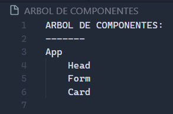
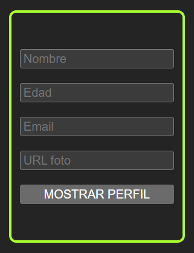
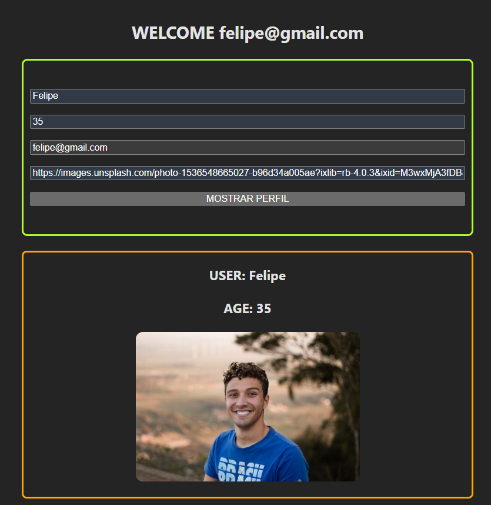

# useContext-form-exercise

Formulario que muestra tarjeta con información del mismo.

Componentes:

Relación entre componentes Form y Card  con Sibling to Sibling.
Relación entre componentes Form y Head  con useContext.

